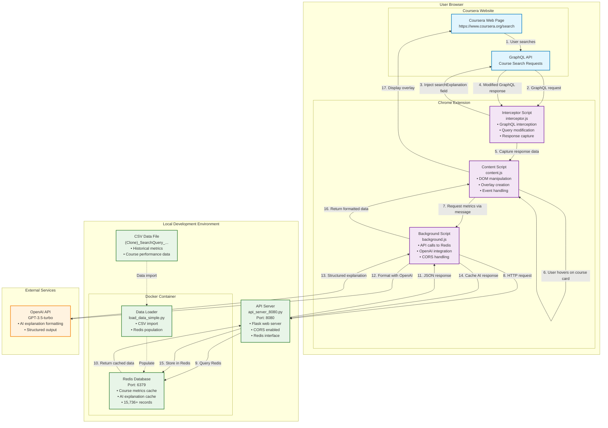

# Architecture Diagram - Editable Mermaid Code



## How to Edit:

### Add a new component:
```mermaid
NEW_COMPONENT["New Component<br/>Description<br/>• Feature 1<br/>• Feature 2"]
```

### Change colors:
```mermaid
classDef newcolor fill:#ff9999,stroke:#cc0000,stroke-width:2px
class NEW_COMPONENT newcolor
```

### Add connections:
```mermaid
COMPONENT1 -->|"Label"| COMPONENT2
```

### Remove components:
Just delete the lines for components you don't want.

## Tools you can use to edit:

1. **Mermaid Live Editor**: https://mermaid.live/
2. **GitHub/GitLab**: Both support Mermaid in markdown
3. **VS Code**: With Mermaid extension
4. **Draw.io**: Can import Mermaid code

Copy the code above and paste it into any of these tools to edit visually!
